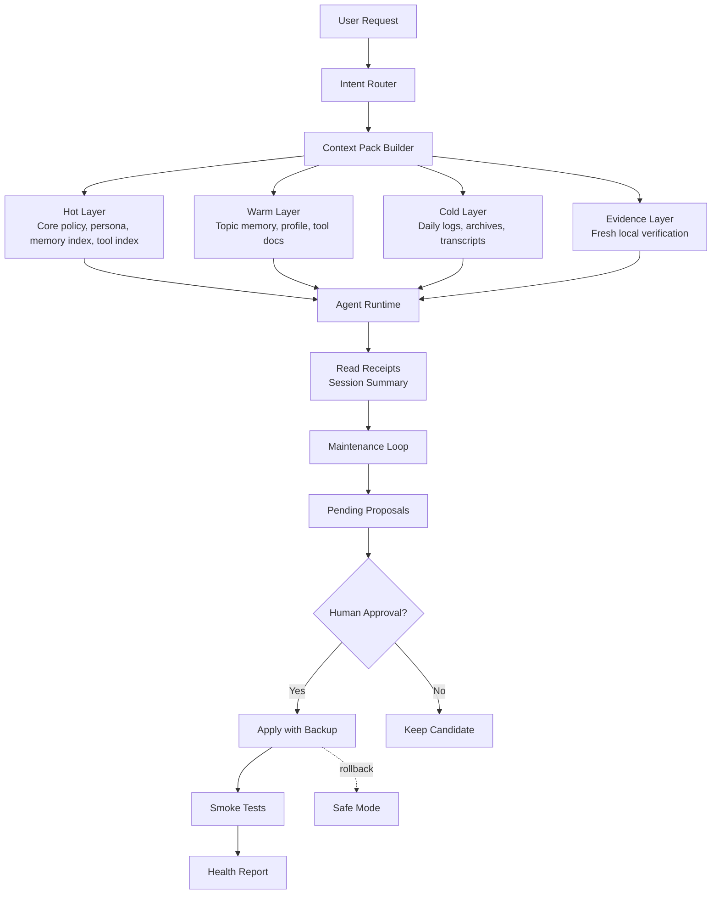

# Agent Context Memory Framework

A lightweight architecture for long-running AI agents that need stable persona memory, lower bootstrap token cost, lazy-loaded work memory, and controlled self-maintenance.

## Design Diagram



## Documentation

- [English design document](docs/en/agent-context-memory-framework-design.md)
- [中文设计文档](docs/zh/agent-context-memory-framework-design.md)

## Problem

Long-running agents often accumulate oversized startup files, repeated workspace injection, mixed memory/tool/persona instructions, and stale operational facts. The result is slower response time, higher token cost, truncation risk, and persona drift.

This framework keeps the runtime small by separating context into three layers:

- **Hot layer:** minimal behavior policy, core persona, memory index, and tool index. Always visible.
- **Warm layer:** topic memory, persona profile, and detailed tool docs. Loaded only when relevant.
- **Cold layer:** daily logs, archives, transcripts, and raw evidence. Searched on demand.

## Core Principles

- Keep the core persona always visible.
- Keep `AGENTS.md`, `TOOLS.md`, and `MEMORY.md` lightweight.
- Route recurring domains through topic memory instead of hot startup files.
- Treat memory as hints for volatile facts; verify current state before acting.
- Let the framework observe usage and generate candidate updates.
- Require human approval before changing core persona, hot memory, tool routing, or framework policy.
- Keep major framework changes backed up, tested, and reversible.

## Suggested Repository Layout

```text
AGENTS.md
BOOTSTRAP_INDEX.md
TOOLS.md
MEMORY.md

memory/
  persona/
    core.md
    profile.md
    relationship.md
  topics/
    index.md
    runtime.md
    deployment.md
    creative-workflows.md
  daily/

docs/
  tools/
  framework/

pending/
  memory-updates/
  tool-updates/
  framework-updates/

reports/
  framework-health.md
  regression-results.md

tests/
  golden-prompts/

backups/
  framework/
```

## Status

This is a design-first public draft. It is intentionally implementation-agnostic and can be adapted to different agent runtimes, coding assistants, chat agents, and local automation systems.

## Recommended First Implementation

Start small:

1. Create a `BOOTSTRAP_INDEX.md`.
2. Keep one compact `memory/persona/core.md` hot-loaded.
3. Convert large `MEMORY.md` and `TOOLS.md` files into indexes.
4. Move recurring work domains into `memory/topics/*.md`.
5. Add smoke tests for persona stability, tool routing, lazy loading, and volatile-fact verification.
6. Add a maintenance loop that creates pending proposals, never silent core changes.
