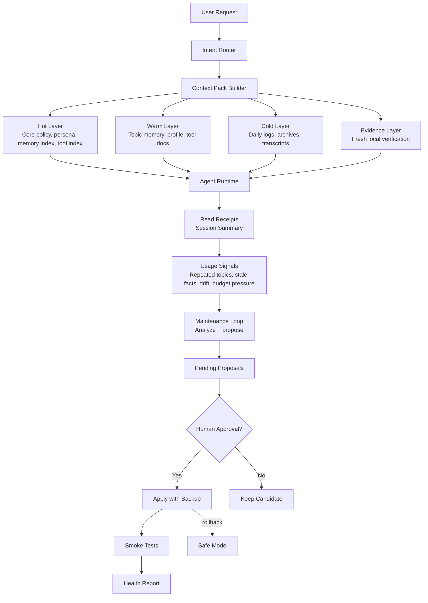

# Agent Context Memory Framework

A lightweight architecture for long-running AI agents that need stable persona memory, lower bootstrap token cost, lazy-loaded work memory, and controlled self-maintenance.

## Why This Exists

This framework came from practical issues observed while running an OpenClaw-style local agent with persona memory, workspace bootstrap files, tool instructions, topic notes, and daily work logs.

The core problem was not a single broken file. It was gradual context growth:

- Bootstrap and workspace files could be re-injected across turns, wasting tokens.
- `MEMORY.md`, `TOOLS.md`, and persona notes could become overloaded with mixed responsibilities.
- Large startup files increased truncation risk, especially for long-term memory.
- Persona instructions, tool rules, deployment notes, and daily logs competed for the same hot context.
- Operational facts such as ports, processes, model state, deployment status, and proxy routing could become stale if memory was trusted without verification.
- Framework updates were useful, but unsafe if the agent could silently modify its own persona, hot memory, or routing policy.

The design goal is to keep the agent fast and stable without deleting valuable memory. Instead of forcing everything into startup context, the framework keeps only the essential layer hot and moves details into indexed, lazy-loaded files.

## Semi-Automatic Evolution

The framework is designed to become more useful as it is used.

It can observe which topics are searched repeatedly, which daily notes become important, which tool routes are misclassified, which files exceed the context budget, and which persona or workflow tests start to drift. From those signals, it creates pending improvement proposals instead of silently rewriting core files.

In practice, this means the agent can gradually build better topic memory, cleaner tool routing, and more accurate maintenance suggestions while keeping the high-risk layers protected:

- It may automatically observe, search, summarize, test, and propose.
- It may suggest promoting repeated daily notes into topic memory.
- It may suggest splitting oversized memory or tool files.
- It may suggest new smoke tests when recurring failures appear.
- It must not silently change core persona, hot memory, tool routing, framework policy, or permission boundaries.

The intended result is a framework that gets smarter with real usage, but remains reviewable, reversible, and human-approved where it matters.

## Design Diagram



## Documentation

- [English design document](docs/en/agent-context-memory-framework-design.md)
- [中文设计文档](docs/zh/agent-context-memory-framework-design.md)

## Adoption Guides

These guides are intentionally non-destructive. They help users reorganize existing agent memory and context files without overwriting persona, long-term memory, or runtime configuration.

- [OpenClaw adapter guide](docs/en/adapters/openclaw.md) / [中文](docs/zh/adapters/openclaw.md)
- [Hermes adapter guide](docs/en/adapters/hermes.md) / [中文](docs/zh/adapters/hermes.md)

## Problem

Long-running agents often accumulate oversized startup files, repeated workspace injection, mixed memory/tool/persona instructions, and stale operational facts. The result is slower response time, higher token cost, truncation risk, and persona drift.

This framework keeps the runtime small by separating context into three layers:

- **Hot layer:** minimal behavior policy, core persona, memory index, and tool index. Always visible.
- **Warm layer:** topic memory, persona profile, and detailed tool docs. Loaded only when relevant.
- **Cold layer:** daily logs, archives, transcripts, and raw evidence. Searched on demand.

## Benefits

- **Lower token cost:** repeated bootstrap content is reduced, and detailed files are loaded only when relevant.
- **Faster responses:** the agent starts from a smaller context pack and spends less time processing unrelated memory.
- **More stable persona:** core identity stays hot-loaded, while daily logs and work topics no longer dilute the persona layer.
- **Better work memory:** recurring domains such as runtime debugging, creative workflows, deployment, and proxy/network issues can each have focused topic memory.
- **Less truncation risk:** large files are split into indexes, topic docs, archives, and daily logs.
- **Safer operations:** volatile facts are treated as hints and verified against current local state before action.
- **Controlled evolution:** the framework can observe usage and propose improvements, but core persona, hot memory, tool routing, and framework policy still require human approval.
- **Rollback-ready changes:** major updates are expected to include backups, smoke tests, and health reports.

## Core Principles

- Keep the core persona always visible.
- Keep `AGENTS.md`, `TOOLS.md`, and `MEMORY.md` lightweight.
- Route recurring domains through topic memory instead of hot startup files.
- Treat memory as hints for volatile facts; verify current state before acting.
- Let the framework observe usage and generate candidate updates.
- Require human approval before changing core persona, hot memory, tool routing, or framework policy.
- Keep major framework changes backed up, tested, and reversible.

## Suggested Repository Layout

```text
AGENTS.md
BOOTSTRAP_INDEX.md
TOOLS.md
MEMORY.md

memory/
  persona/
    core.md
    profile.md
    relationship.md
  topics/
    index.md
    runtime.md
    deployment.md
    creative-workflows.md
  daily/

docs/
  tools/
  framework/

pending/
  memory-updates/
  tool-updates/
  framework-updates/

reports/
  framework-health.md
  regression-results.md

tests/
  golden-prompts/

backups/
  framework/
```

## Status

This is a design-first public draft. It is intentionally implementation-agnostic and can be adapted to different agent runtimes, coding assistants, chat agents, and local automation systems.

## Recommended First Implementation

Start small:

1. Create a `BOOTSTRAP_INDEX.md`.
2. Keep one compact `memory/persona/core.md` hot-loaded.
3. Convert large `MEMORY.md` and `TOOLS.md` files into indexes.
4. Move recurring work domains into `memory/topics/*.md`.
5. Add smoke tests for persona stability, tool routing, lazy loading, and volatile-fact verification.
6. Add a maintenance loop that creates pending proposals, never silent core changes.
