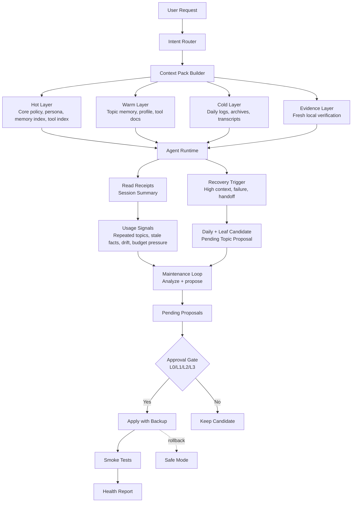

# Agent Context Memory Framework

A practical context and memory hygiene framework for long-running AI agents.

It helps durable assistants stay fast, stable, traceable, and safe as their persona, tools, work notes, and memory grow over time.

> Thin startup. Hot core persona. Lazy-loaded topic memory. Recovery triggers. Approval gates. Provenance. Live verification for volatile facts. Human-reviewed self-evolution.

## Documentation

- [English design document](docs/en/agent-context-memory-framework-design.md)
- [中文设计文档](docs/zh/agent-context-memory-framework-design.md)
- [Optional retrieval layer](docs/en/retrieval-layer.md) / [中文](docs/zh/retrieval-layer.md)
- [OpenClaw adapter guide](docs/en/adapters/openclaw.md) / [中文](docs/zh/adapters/openclaw.md)
- [Hermes adapter guide](docs/en/adapters/hermes.md) / [中文](docs/zh/adapters/hermes.md)
- [Templates](templates/)
- [Basic example workspace](examples/basic-agent-workspace/)
- [Announcement variants](docs/announcement.md)

## Why This Exists

Long-running agents often start simple: one persona file, one memory file, one tool note, and a few workspace instructions.

Then they accumulate:

- Bootstrap and workspace files that are injected repeatedly.
- Large `MEMORY.md`, `TOOLS.md`, or instruction files with mixed responsibilities.
- Persona notes competing with deployment notes, tool manuals, topic notes, and daily logs.
- Stale operational facts such as ports, processes, provider state, model state, branches, and deployment status.
- Useful self-improvement ideas that are risky if applied silently.

A bigger context window helps, but it does not solve the underlying hygiene problem. If every detail is kept hot forever, the agent becomes slower, more expensive, more prone to truncation, and easier to confuse.

This framework keeps valuable memory without forcing all of it into startup context.

## The Core Idea

Separate context by responsibility and risk.

```text
thin startup
+ hot core persona
+ lazy-loaded topic memory
+ searchable cold archives
+ fresh verification for volatile state
+ provenance-aware summaries
+ recovery triggers for long context or failed work
+ self-improving candidate lane for corrections and reflections
+ pending proposals for risky changes
+ four-level approval gates for self-evolution
```

### Context Layers

| Layer | Purpose | Examples |
| --- | --- | --- |
| Hot | Always available, compact, high-priority | Core behavior policy, core persona, memory index, tool index |
| Warm | Loaded only when relevant | Topic memory, profile notes, detailed tool docs, workflow notes, self-improving candidates |
| Cold | Searched on demand | Daily logs, archives, transcripts, raw evidence |
| Evidence | Verified live before action | Ports, processes, provider state, current branches, deployment state, model state |

The hot layer should tell the agent where to look. It should not contain every historical detail.

### Optional Retrieval Layer

The framework can work with vector search, local embedding models, or rerankers, but it does not require them.

```text
hot index -> topic/leaf/digest/promoted corpus -> optional embedding retrieval -> source_refs/provenance check -> live verification when needed
```

Rules:

- Markdown memory files remain the source of truth.
- Embeddings help find relevant memory; they do not prove that memory is correct.
- Rerankers improve ordering; they do not replace review state, provenance, or live verification.
- Core persona must remain reachable through the hot index, not only through vector search.
- Public configs should use placeholders instead of machine-specific model paths.

See [Optional retrieval layer](docs/en/retrieval-layer.md) / [中文](docs/zh/retrieval-layer.md).

## Benefits

- **Lower token cost:** repeated bootstrap content is reduced, and detailed files are loaded only when relevant.
- **Faster responses:** the agent starts from a smaller context pack and spends less time processing unrelated memory.
- **More stable persona:** core identity stays hot-loaded while daily logs and work topics no longer dilute the persona layer.
- **Better work memory:** recurring domains such as runtime debugging, creative workflows, deployment, and proxy/network issues can each have focused topic memory.
- **Traceable memory growth:** summaries can point back to their source notes, daily logs, or raw evidence instead of becoming unverifiable claims.
- **Safer operations:** volatile facts are treated as hints and verified against current local state before action.
- **Recoverable long sessions:** high context pressure, tool failures, or thread handoffs can trigger a fixed recovery workflow.
- **Controlled evolution:** agents can retain corrections and reflections as candidates, but high-risk changes still require human approval.
- **Rollback-ready maintenance:** major framework changes should include backups, smoke tests, and health reports.

## Core Principles

- Keep the core persona always visible.
- Keep `AGENTS.md`, `TOOLS.md`, and `MEMORY.md` lightweight.
- Route recurring domains through topic memory instead of hot startup files.
- Do not promote raw daily logs directly into hot memory; use short indexes and source pointers.
- Use a lightweight memory tree so summaries can be compressed without losing provenance.
- Treat memory as hints for volatile facts; verify current state before acting.
- Treat recovery as a workflow, not a note: daily log, leaf candidate, topic proposal, health check, and resume path.
- Do not say recovery is complete until the recovery completion gate has been checked.
- Keep the memory corpus vector-friendly, but treat embeddings and rerankers as optional retrieval accelerators, not memory authority.
- Keep self-improving corrections and reflections in a warm candidate lane until they are reviewed and approved.
- Let the framework observe usage and generate candidate updates.
- Use approval gates before changing core persona, hot memory, tool routing, permission boundaries, or framework policy.
- Keep major framework changes backed up, tested, and reversible.

## Who Should Use This

This framework is useful for:

- Long-running personal AI assistants.
- Local assistants with durable persona and user preferences.
- OpenClaw-style or Hermes-style workspaces.
- Coding agents with project conventions and recurring tool notes.
- Creative or research agents with large topic memory.
- Operations/deployment agents where stale facts can cause mistakes.
- Any agent that needs memory growth without silent policy/persona drift.

It is less useful for one-shot prompts, stateless bots, or very small projects with no durable memory.

## What This Is / Is Not

This project is:

- A reference design for context and memory organization.
- A set of safe adoption patterns.
- A collection of copyable templates.
- Adapter guidance for existing agent workspaces.
- A safety model for governed self-evolution.

This project is not:

- A mandatory runtime.
- A vector database.
- A requirement to install an embedding model.
- A one-click installer.
- A secret manager.
- A replacement for your existing agent framework.
- A license to let agents silently rewrite their own identity, policy, or permissions.

## Quick Start

Use this as a conservative migration path. Do not overwrite an existing agent workspace blindly.

### 1. Back up first

```bash
mkdir -p backups/framework/$(date +%Y%m%d-%H%M%S)
cp AGENTS.md MEMORY.md TOOLS.md backups/framework/$(date +%Y%m%d-%H%M%S)/ 2>/dev/null
```

If your workspace has persona files, routing files, or local policy files, include them too.

### 2. Inventory current hot context

```bash
wc -c AGENTS.md MEMORY.md TOOLS.md 2>/dev/null
find . -maxdepth 3 -type f | sort
```

Classify what you find:

```text
core behavior rules      -> AGENTS.md
core persona             -> memory/persona/core.md
stable user preferences  -> MEMORY.md or memory/persona/profile.md
tool details             -> docs/tools/*.md
recurring work domains   -> memory/topics/*.md
repeated mistakes         -> memory/self-improving/*.md
daily logs               -> memory/daily/*.md
archives/raw evidence    -> cold storage, searched on demand
```

### 3. Add a bootstrap index

Create a small `BOOTSTRAP_INDEX.md` that routes the agent instead of loading every detail.

```md
# Bootstrap Index

## Always Load

- AGENTS.md - minimal behavior and safety policy.
- MEMORY.md - hot memory index.
- TOOLS.md - thin tool index.
- memory/persona/core.md - core persona.

## Load on Demand

- memory/topics/index.md - topic routing.
- memory/topics/runtime.md - runtime and context notes.
- memory/topics/deployment.md - deployment workflows.
- memory/self-improving/index.md - user corrections and post-task lessons.
- docs/tools/*.md - detailed tool instructions.

## Volatile Facts

Verify current ports, processes, provider state, model state, deployment state, branches, and paths before acting.
```

### 4. Slim hot files

Keep hot files short and index-like.

- `AGENTS.md`: behavior constitution, safety boundaries, lazy-loading rule.
- `MEMORY.md`: stable preferences, memory routing, topic index pointer.
- `TOOLS.md`: tool index, risk level, detailed docs path.
- `memory/persona/core.md`: core persona that must remain visible.

Move long details into topic files and tool docs. Do not delete source memory during the first pass.

Hot Memory Ingestion Gate:

- Keep promoted hot entries short, preferably one or two lines.
- Store event detail, artifact paths, tool logs, and version history in daily notes, leaf summaries, or topic memory.
- Keep source pointers so the agent can drill down when the detail matters.
- Treat `MEMORY.md` as a hot index, not an event log.
- Use roughly 8k chars as a lightweight target and 10k chars as a practical warning threshold.
- If `MEMORY.md` exceeds the hot budget, compress long promoted entries into indexes before adding more content.

Promoted Hot-Layer Guard:

- Detect sections such as `Promoted From Short-Term Memory` inside `MEMORY.md`.
- Warn when promoted content is long, for example above roughly 3k chars.
- Move the promoted block unchanged into warm storage such as `memory/promoted/YYYY-MM-DD-short-term-promotions.md`.
- Replace the hot block with a 3-5 line source-linked index.
- Allow this as a bounded standing cleanup only when promotion source markers exist, referenced sources still exist, and no protected content is mixed in.
- Stop for explicit approval if cleanup would require rewriting, summarizing, merging, redacting, overwriting evidence, or touching persona/tool/framework policy.

### 5. Add topic memory

Create focused files for recurring work domains:

```text
memory/topics/index.md
memory/topics/runtime.md
memory/topics/deployment.md
memory/topics/proxy.md
memory/topics/creative-workflows.md
```

Each topic should include durable notes, known pitfalls, verification rules, and source references where useful.

### 6. Add provenance

When summarizing memory, preserve enough metadata to audit it later.

Useful fields:

```yaml
source_refs:
  - memory/daily/2026-01-01.md:12-18
derived_from:
  - session:example-session-id
confidence: medium
last_verified: 2026-01-01
review_state: proposed
```

The goal is not bureaucracy. The goal is to avoid unverifiable memory claims.

### 7. Add a framework health check

At minimum, periodically check:

- Hot file sizes.
- Whether `MEMORY.md` contains long promoted short-term sections.
- Whether topic routing still matches real work.
- Whether daily notes should be promoted into topic memory.
- Whether any volatile fact is being treated as permanent memory.
- Whether persona/tool-routing/policy changes are waiting in `pending/`.

See [framework health report template](templates/framework-health-report.md).

## Recommended Repository Layout

```text
AGENTS.md
BOOTSTRAP_INDEX.md
TOOLS.md
MEMORY.md

memory/
  persona/
    core.md
    profile.md
    relationship.md
  topics/
    index.md
    runtime.md
    deployment.md
    proxy.md
    creative-workflows.md
  daily/
  leaves/
  promoted/
  digests/

docs/
  tools/
  framework/

pending/
  memory-updates/
  tool-updates/
  framework-updates/
  persona-profile-updates/

reports/
  framework-health.md
  regression-results.md

tests/
  golden-prompts/

backups/
  framework/
```

## Safety Model

The framework is designed to evolve, but not silently mutate high-risk layers.

### Safe to automate

Agents may:

- Observe which topics are searched repeatedly.
- Detect oversized hot files.
- Summarize daily notes into candidate leaf summaries.
- Suggest topic-memory promotions.
- Suggest tool-doc splits.
- Suggest smoke tests when repeated failures appear.
- Generate pending improvement proposals.

### Requires human approval

Agents should not silently change:

- Core persona.
- Hot memory.
- Tool routing.
- Permission boundaries.
- Framework policy.
- Security rules.
- Runtime/provider routing.

### Approval gates

Use approval levels so the agent asks at the right time instead of relying on the user to remember every boundary.

| Level | Meaning | Examples |
| --- | --- | --- |
| L0 Auto | Safe to do and report briefly | Read/search memory, create candidate leaf summaries, generate pending proposals, run health checks |
| L1 Notify | Safe to continue, but must be visible | Tool failure, aborted run, timeout, high context pressure, recovery workflow starting |
| L2 Approval | Ask before applying | Update topic memory, promote a leaf into active memory, change tool routing, restart a local service |
| L3 Strong Approval | Require explicit target-specific approval | Modify core persona, hot memory, framework policy, permission boundaries, delete/redact evidence, external/public sends |

Generic phrases like "continue" or "do it" should not count as L3 approval unless the protected target is named.

Narrow exception: long automatic promoted-memory sections may be cleaned mechanically when they have promotion source markers, the referenced sources still exist, the block is moved unchanged to `memory/promoted/`, and `MEMORY.md` receives only a short source-linked index. This does not authorize rewriting hot memory or changing persona, tools, framework policy, permissions, or evidence.

### Recovery triggers

Long-running agent sessions need a recovery path that is stronger than "write a daily note".

Trigger recovery when:

- context pressure is high enough to make long work risky
- a tool returns `aborted`, `timeout`, `502`, post-processing errors, or ambiguous delivery state
- the user asks to compact, reset, start a new thread, or resume later
- a project needs a durable handoff point

For significant incidents, recovery should create or verify:

- visible user status
- project recovery file or resume note
- raw daily log
- leaf candidate with provenance
- pending topic proposal when durable state should be promoted
- health check result
- exact resume path

Completion gate:

The agent should not say `recovery complete` until the required outputs have been checked. If something is missing, it should say which item is missing and finish that item before declaring completion. If the health check passes with warnings, the warnings should be named explicitly.

### Must be verified live

Memory should be treated as a hint, not truth, for volatile facts such as:

- Ports and processes.
- Current model/provider state.
- Gateway status.
- Deployment status.
- Git/SVN branches and revisions.
- Local paths that may have moved.
- External service availability.

## Memory Tree Lite

The framework encourages a lightweight memory compression path:

```text
raw daily notes
-> leaf summaries
-> topic proposals
-> approved topic memory
-> periodic digest
```

Each step should preserve source references when practical.

This lets agents keep long-term knowledge compact without losing the ability to trace important claims back to raw notes.

## Self-Improving Lane

The framework also supports a minimal correction/reflection lane:

```text
memory/self-improving/index.md
memory/self-improving/corrections.md
memory/self-improving/reflections.md
```

Use it for explicit user corrections, repeated mistakes, repeated tool-routing failures, and post-task lessons. Each record should be short, vector-friendly, and include `source_refs`, `confidence`, `review_state`, `verify_before_use`, `valid_until`, `last_seen_at`, `evidence_count`, `superseded_by`, and clear `Use When` / `Do Not Use When` boundaries.

Minimal duplicate handling is intentionally narrow:

- If the same lesson appears again, append the new `source_refs`, update `last_seen_at`, and increment `evidence_count`.
- If a newer lesson replaces an older lesson, mark the older record `review_state: superseded` and fill `superseded_by`.
- Semantic merge, deletion, or promotion still requires a reviewed pending proposal.

This lane is a warm candidate buffer. It does not directly change `MEMORY.md`, topic memory, persona, tool routing, permissions, or framework policy.

Promotion path:

```text
self-improving candidate
-> pending/memory-updates proposal
-> user approval
-> memory/topics/* or short MEMORY.md index pointer
```

Optional read-only maintenance tool:

```bash
bin/self-improving-health.zsh --workspace examples/basic-agent-workspace
```

The tool writes `reports/self-improving-health.md` and a pending maintenance proposal. It does not edit memory records, mark records stale, merge, delete, or promote anything.

## Semi-Automatic Evolution

The framework can become more useful as it is used.

It may notice:

- A topic is repeatedly searched.
- A tool route is repeatedly misclassified.
- A hot file exceeds the desired context budget.
- A daily note is repeatedly recalled.
- A workflow has recurring failures.
- A persona or tool-routing smoke test starts drifting.

From those signals, it creates pending proposals instead of silently rewriting core files.

The intended result is an agent that improves its workspace hygiene while remaining reviewable, reversible, and human-approved where it matters.

## Design Diagram



## Adoption Guides

These guides are intentionally non-destructive. They help users reorganize existing agent memory and context files without overwriting persona, long-term memory, secrets, or runtime configuration.

### OpenClaw Adapter

The [OpenClaw adapter guide](docs/en/adapters/openclaw.md) explains how to apply this pattern to an existing OpenClaw-style workspace.

It is intentionally non-destructive:

- Back up first.
- Record current file sizes.
- Do not edit secrets or provider credentials.
- Do not delete memory in the first pass.
- Do not automatically rewrite the core persona.
- Treat runtime facts as volatile and verify them live.

Chinese version: [OpenClaw 适配指南](docs/zh/adapters/openclaw.md)

### Hermes Adapter

The [Hermes adapter guide](docs/en/adapters/hermes.md) maps the framework onto Hermes-native active overlays such as `SOUL.md`, `USER.md`, compact hot memory, and workspace routing. It does not require copying the OpenClaw file layout, and it calls out Hermes-specific prompt-cache and deferred-invalidation constraints.

Chinese version: [Hermes 适配指南](docs/zh/adapters/hermes.md)

## Templates and Example

Use these when adapting the design to a real workspace:

- [Templates](templates/) - copyable starting points for hot indexes, persona core, topic memory, leaf summaries, digests, and health reports.
- [Basic example workspace](examples/basic-agent-workspace/) - a fake, minimal workspace showing how the pieces fit together.

These are implementation aids, not mandatory runtime components.

## Example Result

In one local OpenClaw-style workspace, splitting oversized hot files into a compact memory index, thin tool index, topic notes, tool docs, and archives reduced the approximate hot injected context by about two thirds.

This is a practical case study, not a formal benchmark. Your result will depend on runtime behavior, workspace size, retrieval strategy, and what your agent injects by default.

## Recommended First Implementation

Start small:

1. Create a `BOOTSTRAP_INDEX.md`.
2. Keep one compact `memory/persona/core.md` hot-loaded.
3. Convert large `MEMORY.md` and `TOOLS.md` files into indexes.
4. Move recurring work domains into `memory/topics/*.md`.
5. Add smoke tests for persona stability, tool routing, lazy loading, and volatile-fact verification.
6. Add provenance fields such as `source_refs`, `derived_from`, `confidence`, and `last_verified`.
7. Add a maintenance loop that creates pending proposals, never silent core changes.
8. Add a promoted hot-layer guard so automatic promotions cannot turn `MEMORY.md` back into an event log.
9. Keep the corpus vector-friendly and evaluate vector search or reranking only when the Markdown corpus becomes large enough to need retrieval acceleration.

The [basic example workspace](examples/basic-agent-workspace/) is a safe reference shape. Do not copy it over an existing workspace without first backing up and adapting the placeholders.

## Roadmap

Possible next steps:

- Add a lightweight context budget report.
- Add more golden prompt tests for persona, tool routing, and volatile-fact verification.
- Add memory promotion helper scripts.
- Add more adapter guides for other agent runtimes.
- Add optional checks for oversized hot files and missing provenance.
- Add examples for team/workspace variants.

## Contributing

Issues, examples, adapter improvements, and safety feedback are welcome.

Please do not post secrets, provider credentials, private memory contents, raw personal logs, or sensitive local paths in public issues.

When proposing changes, prefer:

- Concrete use cases.
- Minimal, reversible adoption steps.
- Clear safety boundaries.
- Backward-compatible patterns.
- Examples that can be understood without private context.

## License

MIT. See [LICENSE](LICENSE).

## Status

This is a design-first public draft. It is intentionally implementation-agnostic and can be adapted to different agent runtimes, coding assistants, chat agents, and local automation systems.
