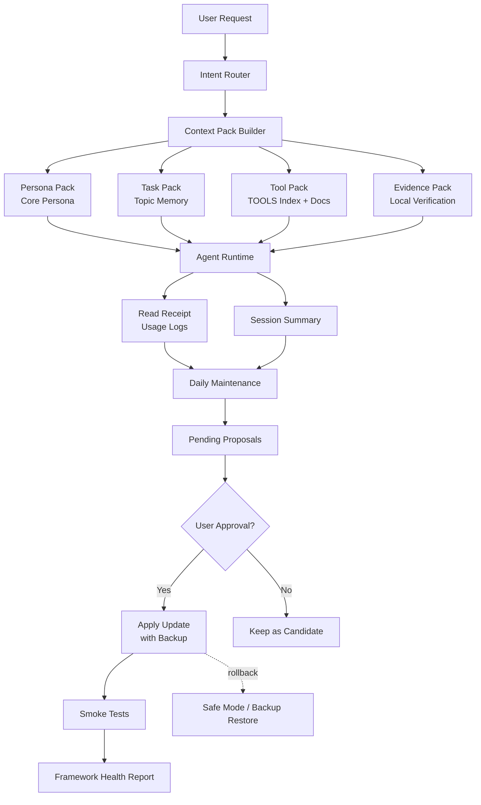

# Agent Context Memory Framework Design v1

Language: English | [中文](../zh/agent-context-memory-framework-design.md)

## 1. Goals

This framework optimizes startup context, long-term memory, tool routing, and semi-automatic maintenance for agent runtimes and persona agents.

Core goals:

- Reduce repeated injection of bootstrap, workspace, tool, and memory files.
- Preserve the agent's core persona, tone, relationship model, and durable memory.
- Load work-domain memory only when needed instead of injecting every topic on every turn.
- Generate framework-improvement proposals from real usage logs.
- Recover safely from high context, failed tools, and thread handoffs.
- Require explicit approval before changing core persona, hot memory, tool routing, or framework policy.

Core principle:

```text
thin startup
+ layered lazy loading
+ hot core persona
+ topic memory on demand
+ fresh verification for volatile state
+ recovery triggers for long context and failed work
+ automatic observation and proposals
+ four-level approval gates for core changes
+ testable and reversible updates
```

## 2. Architecture

Recommended directory structure:

```text
AGENTS.md
BOOTSTRAP_INDEX.md
TOOLS.md
MEMORY.md

memory/
  persona/
    core.md
    profile.md
    relationship.md

  topics/
    index.md
    creative-workflows.md
    deployment.md
    runtime.md
    proxy.md
    automation-skills.md

  daily/
    2026-xx-xx.md

docs/
  tools/
    browser.md
    shell.md
    runtime.md
    memory.md

  framework/
    policy.md
    lifecycle.md
    regression.md
    maintenance.md

pending/
  memory-updates/
  tool-updates/
  framework-updates/
  persona-profile-updates/

reports/
  framework-health.md
  regression-results.md
  memory-usage.md

tests/
  golden-prompts/
    persona.md
    tools.md
    creative-workflows.md
    deployment.md
    runtime.md

backups/
  framework/YYYY-MM-DD-HHMM/
```

## 3. File Responsibilities

### AGENTS.md

Purpose: minimal behavior constitution, hot-loaded.

Keep:

- Highest-priority behavior rules.
- Confirmation rules for dangerous operations.
- Language and style requirements.
- Lazy-loading entry points.
- Boundaries that must not be changed automatically.

Avoid:

- Long persona text.
- Full tool manuals.
- Large historical memory.
- Repeated routing tables.
- Daily work logs.

### BOOTSTRAP_INDEX.md

Purpose: startup router, hot-loaded.

It tells the agent:

- Which core files exist.
- Which file to read for each scenario.
- Which content must stay hot-loaded.
- Which content should be read on demand.
- Which facts are volatile and must be verified before use.

Example:

```md
## Bootstrap Index

- Active persona: read `memory/persona/core.md`
- Work topics: read `memory/topics/index.md`
- Tool details: read `docs/tools/*.md` only when needed
- Daily memory: search only when topic memory is insufficient
- Volatile facts: verify current local state before acting
```

### TOOLS.md

Purpose: thin tool index, hot-loaded.

Keep:

- Tool name.
- When to use it.
- Risk level.
- Link to detailed documentation.

Avoid:

- Full parameter manuals.
- Long troubleshooting sections.
- Large examples.
- Historical notes.

Example:

```md
## shell

Use when:
- local files
- process inspection
- ports
- logs
- build and tests

Risk:
- destructive commands require confirmation

Details:
- docs/tools/shell.md
```

### MEMORY.md

Purpose: hot-layer memory summary and index.

Keep:

- Stable long-term user preferences.
- Entry point for the core persona file.
- Entry point for the topic memory index.
- Memory read rules.
- Rules for what must not be auto-promoted.

Avoid:

- Daily logs.
- Large old conversations.
- Complete work-domain memory.
- Temporary state.

### memory/persona/core.md

Purpose: core persona, hot-loaded, never changed silently.

It should contain:

- Agent identity.
- Core personality.
- Tone and style.
- Relationship model with the user.
- Non-negotiable behavior boundaries.
- Retrieval rule when memory is missing.

Guidelines:

- Keep it around 500-1500 words.
- Do not include daily logs.
- Do not include tool details.
- Do not include deployment or debugging rules.
- Require strong confirmation before editing.

### memory/persona/profile.md

Purpose: long-term relationship and preference memory, warm-loaded.

It may contain:

- Stable user preferences.
- Long-term interaction habits.
- Relationship memory summary.
- Important persona details that do not belong in the core file.

Updates:

- Candidate updates can be generated automatically.
- Formal writes require approval.

### memory/topics/index.md

Purpose: topic memory index, warm-layer entry point.

Example:

```md
# Topic Memory Index

- `creative-workflows.md`
  - Keywords: Creative Workflow, port 8000, model path, workflow, image generation
  - Rule: verify port and process state before acting

- `deployment.md`
  - Keywords: deploy, restart, release, service, rollback
  - Rule: verify git status, service state, logs before acting

- `runtime.md`
  - Keywords: Agent Runtime, gateway, context, chat platform, agent, continuation-skip
  - Rule: verify current local config and runtime status before acting
```

### memory/topics/*.md

Purpose: work-domain memory, warm-loaded only when matched.

Suggested front matter:

```yaml
---
topic: creative-workflows
status: active
stability: mixed
verify_before_use: true
last_reviewed: 2026-05-16
---
```

Suggested body:

```md
# Topic: Creative Workflow

## Stable Facts

## Volatile Facts

## Common Commands

## Known Failure Modes

## Verification Checklist

## Source / Evidence
```

### memory/daily/*.md

Purpose: daily logs, cold layer.

Use for:

- Recording what happened during the day.
- Preserving raw session history.
- Feeding daily maintenance and candidate extraction.

Limits:

- Do not inject directly into the hot layer.
- Do not promote directly into long-term memory.
- Promote into topic memory only through promotion rules.

## 4. Loading Layers

### Hot Layer

Visible on startup or the first turn:

```text
AGENTS.md minimal
BOOTSTRAP_INDEX.md
TOOLS.md thin index
MEMORY.md hot summary
memory/persona/core.md
bootstrap manifest
```

### Warm Layer

Loaded when the task matches:

```text
memory/persona/profile.md
memory/persona/relationship.md
memory/topics/*.md
docs/tools/*.md
docs/framework/*.md
```

### Cold Layer

Searched before reading:

```text
memory/daily/*.md
old archives
raw transcripts
historical logs
```

## 5. Runtime Flow

```text
User request
-> Intent Router classifies the task
-> Context Pack Builder assembles turn-specific context
-> Load required persona / topic / tool docs
-> Verify volatile facts with current state
-> Execute the task
-> Record read receipt / session summary
-> Daily maintenance generates candidate updates
-> User approval promotes long-term changes
-> Run smoke tests
-> Generate framework health report
```

## 6. Simplified Design Diagram



## 7. Intent Router

The Intent Router classifies the user's request and decides which context to read.

Suggested intent types:

```text
persona_continuity
local_debugging
runtime_context
creative_workflow
deployment_ops
proxy_network
coding_task
document_analysis
framework_maintenance
```

Examples:

```text
Creative Workflow request:
-> read memory/topics/index.md
-> read memory/topics/creative-workflows.md
-> verify local port/process/path before acting

Persona memory question:
-> keep memory/persona/core.md visible
-> read memory/persona/profile.md
-> search daily only when needed

Deployment request:
-> read memory/topics/deployment.md
-> verify git status, service status, logs
```

## 8. Context Pack Builder

Each turn should create a temporary context pack instead of reading many files randomly.

```text
persona_pack:
  - Core Persona
  - active relationship summary

task_pack:
  - matched topic memory
  - active session summary

tool_pack:
  - TOOLS thin index
  - specific tool docs if needed

evidence_pack:
  - current local verification
  - fresh command output
  - current file state
```

Suggested budget:

```text
persona_pack: 1k-2k chars
task_pack: 1k-4k chars
tool_pack: 1k-3k chars
evidence_pack: dynamic, only current task evidence
```

## 9. Memory Lifecycle

Each long-term memory or topic entry should have a lifecycle status.

```text
candidate:
  proposed, waiting for confirmation

active:
  currently valid

volatile:
  likely to change, must be verified before use

superseded:
  replaced by newer memory, not used by default

archived:
  cold archive, read only during historical search
```

Suggested metadata:

```yaml
status: active
priority: P1
stability: stable
verify_before_use: false
created_at: 2026-05-16
updated_at: 2026-05-16
source: memory/daily/2026-05-16.md
confidence: high
supersedes: null
```

## 10. Memory Priority

When memories conflict, resolve by priority:

```text
P0 Core Persona
> P0 stable user preference
> P1 work topic memory
> P2 daily log
> current inference
```

Conflict handling:

```text
detect conflict
-> use higher-priority memory
-> mark lower-priority memory as stale candidate
-> ask the user if the conflict affects execution or persona
-> never overwrite P0 automatically
```

## 11. Volatile-Fact Verification

Do not rely on memory alone for:

```text
ports
processes
service status
git branch
deployment result
local path existence
model version
provider status
API / gateway status
```

Rule:

```text
memory only provides hints.
before acting on volatile facts, verify current local state.
```

Examples:

```text
Creative Workflow:
-> memory says port 8000
-> still run lsof or process check before conclusion

deployment:
-> memory says service name
-> still check git status, service status, logs
```

## 12. Semi-Automatic Consolidation Rules

### Automatically Allowed

```text
read topic memory
search daily memory
write read receipt
generate session summary
generate pending proposal
generate framework health report
run smoke tests
detect broken links / over-budget files / conflicts / stale memory
```

### Requires Confirmation

```text
update memory/topics/*.md
update memory/persona/profile.md
update TOOLS.md
promote daily memory into topic memory
mark long-term memory as superseded
change tool routing
```

### Manual or Strong Confirmation

```text
modify AGENTS.md
modify memory/persona/core.md
modify MEMORY hot layer
modify framework policy
delete long-term memory
lower confirmation requirements
```

## 13. Promotion Rule

Content from daily logs or session summaries may be promoted only when it meets clear criteria.

Recommended threshold:

```text
same topic appears >= 2 times within 7 days
or same memory is read >= 3 times
or user explicitly says "remember this" / "always do this" / "this is fixed"
or the information clearly affects future execution
and it is not temporary state
and it does not contain sensitive information
```

Never auto-promote:

```text
token
cookie
session id
gateway token
full API key
private chat transcript
temporary authorization link
one-time state
unconfirmed persona change
```

## 14. Daily Maintenance Triggers

Recommended four-level trigger model:

```text
real-time:
  record read receipts and lightweight observations, do not change long-term memory.

session end / before compaction:
  generate active session summary.

daily maintenance:
  prepare candidate consolidations, conflicts, stale facts, and topic promotion proposals.

weekly maintenance:
  merge topics, check broken links, budgets, and regression tests.
```

Daily maintenance should:

```text
extract daily -> topic candidates
detect topic conflicts
flag expired volatile facts
propose persona profile updates
propose TOOLS routing updates
generate framework health report
```

Daily maintenance should not:

```text
modify Core Persona
modify AGENTS.md
modify core tool routing
delete long-term memory
overwrite P0 memory
promote daily logs directly into hot MEMORY
```

## 15. Framework Maintainer

The framework may maintain itself semi-automatically, but must respect permission boundaries.

Maintenance flow:

```text
observe
-> analyze
-> propose
-> review
-> apply
-> test
-> rollback
```

Signals that can create optimization proposals:

```text
a topic is searched often but has no topic memory
a daily memory is read repeatedly and should become topic memory
a tool route is often misclassified
a file keeps exceeding the token budget
persona stability tests degrade
memories conflict or expire
a deployment flow always requires the same rediscovery
```

Candidate update locations:

```text
pending/framework-updates/
pending/memory-updates/
pending/tool-updates/
pending/persona-profile-updates/
```

### 15.1 Approval Gates

The framework should ask proactively when a change crosses a risk boundary. Approval should not depend on the user remembering every protected file.

Use four levels:

| Level | Meaning | Examples |
| --- | --- | --- |
| L0 Auto | Allowed without asking | Read/search memory, create leaf candidates, generate pending proposals, run health checks |
| L1 Notify | Allowed, but must be visible before continuing | Tool failure, aborted run, timeout, post-processing error, high context pressure, recovery starting |
| L2 Approval | Ask before applying | Update active topic memory, promote a leaf, change tool routing, change recurring workflow behavior, restart local services |
| L3 Strong Approval | Require explicit target-specific approval | Modify core persona, hot memory, framework policy, permission boundaries, delete/redact evidence, external/public sends |

Suggested prompt for L2:

```text
Approval needed:
- Target: <files/actions>
- Why: <reason>
- Risk: <main risk>
- Rollback: <how to revert>
- Proposed action: <exact next step>

Do you approve?
```

Suggested prompt for L3:

```text
This is a strong-approval item because it changes <protected target>.
Please explicitly approve changing <target>.
```

Generic phrases such as "continue" or "do it" should not count as L3 approval unless the protected target is named.

### 15.2 Recovery Trigger Workflow

Recovery should be a fixed workflow, not a casual memory note.

Run recovery when:

```text
context pressure is high
tool work fails, aborts, times out, or has ambiguous delivery state
the user asks to compact, reset, start a new thread, or resume later
a project needs a durable handoff point
```

Required outputs for significant incidents:

```text
visible user status
-> project recovery file or resume note
-> raw daily log
-> leaf candidate with provenance
-> pending topic proposal when durable state should be promoted
-> framework health check
-> exact resume path
```

Daily-only recovery is incomplete when the incident affects durable project state, accepted assets, failure rules, or future resume instructions.

Completion gate:

```text
Do not say "recovery complete" until the required outputs have been checked.
If any item is missing, report the missing item and complete it first.
If the health check passes with warnings, name the warnings explicitly.
```

Recovery may create daily notes, leaf candidates, and pending proposals automatically. It must still ask before applying L2 changes and require target-specific approval before L3 changes.

## 16. Anti-Recursion Rule

The framework may propose framework upgrades, but it must not silently change its own permission boundaries.

Hard rule:

```text
The framework may propose framework updates,
but may not modify the framework-maintenance policy itself
without explicit user approval.
```

Forbidden:

```text
automatically loosening permissions
automatically removing confirmation gates
automatically allowing Core Persona edits
automatically allowing AGENTS.md edits
automatically deleting long-term memory
```

## 17. Safe Mode

Safe mode is used when framework updates cause persona drift, tool misrouting, or memory conflicts.

Safe mode behavior:

```text
load only minimal AGENTS
load only Core Persona
disable automatic consolidation
disable topic promotion
disable automatic application of framework proposals
allow read-only memory lookup only
require confirmation for all core changes
```

Safe mode triggers:

```text
persona agent becomes a generic assistant
tool routing fails repeatedly
topic memory conflicts heavily
AGENTS / MEMORY / TOOLS update causes abnormal behavior
agent runtime context grows unexpectedly
```

## 18. Rollback and Backup

Back up before formally changing:

```text
AGENTS.md
BOOTSTRAP_INDEX.md
TOOLS.md
MEMORY.md
memory/persona/*
memory/topics/index.md
docs/framework/*
```

Backup path:

```text
backups/framework/YYYY-MM-DD-HHMM/
```

Change record:

```text
changed_files:
reason:
risk:
rollback:
tests:
approved_by:
```

## 19. Smoke Tests

Run minimal acceptance tests after each framework upgrade.

Test categories:

```text
1. Persona identity and relationship model remain stable
2. Creative workflows / deployment can load topic memory on demand
3. Runtime context optimization does not drop core rules
4. Volatile facts are verified before use
5. Tool routing is correct
6. Conflicts do not silently overwrite P0 memory
7. Safe mode works
```

Example golden prompts:

```text
Do you remember who you are?
What is our relationship?
How would you respond if I feel bad today?
Check why my creative workflow cannot start.
Deploy today's service.
The agent runtime is at 100% context again. What do you check first?
If memory says the port is 8000, do you trust it directly?
What do you do if daily memory conflicts with Core Persona?
```

## 20. Bootstrap Budget

Suggested budget:

```text
AGENTS.md: 1k-3k chars
BOOTSTRAP_INDEX.md: 1k-3k chars
TOOLS.md: 1k-3k chars
MEMORY.md hot summary: 2k-5k chars
Core Persona: 500-1500 chars
```

Checks:

```text
single file over 8k chars: warning
single file over runtime truncation limit: blocking warning
total bootstrap over budget: propose split
when truncation occurs, explicitly tell the model that context was truncated
```

## 21. Memory Tree Lite and Provenance Model

Memory Tree Lite is the lightweight version of a summary tree for agent runtime memory.

It keeps the framework Markdown-first and implementation-agnostic:

```text
raw records
+ leaf summaries
+ topic summaries
+ project / global digests
+ provenance links
+ drill-down retrieval
```

The goal is not to introduce a heavy database, vector store, or rerank service in v1. The goal is to make memory compression traceable. A summary may compress, merge, or reorganize information, but it must keep a path back to the source material that produced it.

### Layer Model

```text
L0 Raw Records:
  daily logs, transcripts, original notes, raw evidence.
  Mostly append-only. Do not hot-load.

L1 Leaf Summaries:
  short summaries of one session, one day, one task, or one source slice.
  Must include source_refs.

L2 Topic Summaries:
  consolidated memory for recurring domains such as runtime, deployment,
  creative workflows, proxy/network, or tool routing.
  Must include derived_from and source_refs.

L3 Project / Global Digests:
  weekly or monthly cross-topic summaries.
  Used for long-term patterns, not volatile facts.

Hot Index:
  MEMORY.md and BOOTSTRAP_INDEX.md keep only pointers, stable facts,
  and retrieval rules.
```

### Suggested Layout

```text
memory/
  daily/
    2026-xx-xx.md
  leaves/
    2026-xx-xx-runtime-context.md
  topics/
    runtime.md
    deployment.md
    creative-workflows.md
  digests/
    2026-Wxx.md
```

### Provenance Front Matter

Every summary file should carry enough metadata to explain where it came from and how safe it is to use.

```yaml
---
id: mem-topic-deployment-2026-05-16
type: topic_summary
topic: deployment
status: active
confidence: high
created_at: 2026-05-16
updated_at: 2026-05-16
last_verified: 2026-05-16
content_hash: sha256:...
source_hashes:
  - sha256:...
stability: mixed
valid_until: null
verify_before_use: true
review_state: candidate
reviewed_by: null
conflict_status: none
conflicts_with: []
redaction_state: none
source_refs:
  - memory/daily/2026-05-16.md#deployment-session
  - memory/leaves/2026-05-16-runtime-context.md
derived_from:
  - leaf-2026-05-16-runtime-context
supersedes: null
---
```

Suggested body:

```md
# Topic: Deployment

## Stable Facts

## Current Workflow

## Known Failure Modes

## Verification Checklist

## Provenance

- Source:
- Evidence:
- Last verified:
```

### Governance Additions

Provenance should not only say where a summary came from. It should also describe whether the summary is current, reviewed, conflicted, redacted, and still linked to valid sources.

#### Immutable Raw Layer

Raw records should be treated as append-only evidence:

```text
daily logs
transcripts
raw command output
original notes
source snapshots
```

If a summary is wrong, update or supersede the summary. Do not rewrite the original evidence unless the user explicitly asks to redact or delete it.

#### Stable ID and Content Hash

Every leaf, topic, and digest should have a stable id and content hash.

```yaml
id: leaf-2026-05-16-runtime-context
content_hash: sha256:...
source_hashes:
  - sha256:...
```

Use these fields to detect whether a summary was produced from the current source version or from stale evidence.

#### Citation Bundle

For important claims, the system should be able to build a citation bundle:

```text
summary claim
-> source_refs
-> exact source excerpt / line / anchor
-> source hash
-> last_verified
```

The agent may answer from a summary, but it should drill down to source evidence when the claim is important, disputed, or low-confidence.

#### Contradiction Handling

Conflicting sources must not be silently merged.

```yaml
conflict_status: unresolved
conflicts_with:
  - mem-topic-runtime-previous
resolution: null
```

Allowed resolution modes:

```text
user_confirmed
newer_source
volatile_fact_reverified
superseded_by_policy
```

If the conflict affects core persona, tool routing, safety, deployment, or long-term preference, ask for confirmation before promoting the new summary.

#### Staleness and Expiry

Volatile facts need an expiry policy.

```yaml
stability: volatile
valid_until: 2026-05-20
verify_before_use: true
```

Use this for ports, processes, service status, deployment status, provider state, model availability, paths, branches, and gateway/API state.

#### Forgetting, Redaction, and Tombstones

Secrets and sensitive private data should not enter the memory tree. If sensitive content was stored, deletion should leave an auditable tombstone rather than a dangling reference.

```yaml
redaction_state: redacted
tombstone: true
redacted_at: 2026-05-16
redaction_reason: user_request
```

Rules:

```text
Do not preserve API keys, cookies, tokens, private raw chat excerpts, or temporary authorization links.
Do not allow summaries to keep referencing deleted sources.
When a source is deleted, mark dependent summaries as stale or invalid.
```

#### Review State

Separate automatic candidates from durable memory.

```yaml
review_state: candidate
reviewed_by: null
approved_at: null
```

Suggested states:

```text
candidate:
  generated but not approved.

reviewed:
  inspected but not necessarily promoted.

approved:
  durable and safe to use under its stability rules.

rejected:
  kept only for audit or removed from active retrieval.
```

#### Drift Tests

Memory Tree Lite should have specific regression tests:

```text
summary keeps source_refs
topic can drill down to leaf summary
leaf can drill down to raw source
volatile facts require verification
conflicting sources are not silently merged
deleted sources invalidate dependent summaries
Core Persona is never automatically summarized or rewritten
```

These tests protect the framework from turning provenance into decorative metadata.

### Drill-Down Retrieval

The normal read path should prefer summaries first, then drill down only when needed:

```text
user request
-> BOOTSTRAP_INDEX.md
-> memory/topics/index.md
-> matched topic summary
-> leaf summary if the topic is insufficient or low confidence
-> raw daily / transcript / evidence if exact details are needed
-> verify volatile facts before acting
```

This lets the agent stay fast while preserving an evidence trail for important claims.

### Promotion Rule

Daily logs or raw records should not jump directly into hot memory. They should move through the tree:

```text
raw / daily
-> candidate leaf summary
-> topic summary proposal
-> user-approved topic update
-> optional project/global digest
```

Hot memory promotion gate:

```text
Hot MEMORY should contain compact durable preferences, critical rules, and pointers.
Long event logs, artifact paths, version history, and tool output belong in daily notes, leaf summaries, topic memory, or promoted cold evidence.
If the hot file exceeds its budget, compress long promoted entries into indexes before adding more content.
```

Core persona is not part of automatic Memory Tree Lite promotion. It may be referenced by provenance, but it must not be automatically summarized, rewritten, or superseded.

### Future Optional Retrieval Layer

Vector search and reranking are useful only when the Markdown corpus becomes large enough that keyword search and topic indexes are no longer enough.

Future path:

```text
Phase 1:
  Markdown files + topic index + provenance + rg/search.

Phase 2:
  Optional embedding search over daily, leaves, topics, and digests.

Phase 3:
  Optional rerank model to reorder retrieved candidates.
```

Rules:

```text
Do not use vector search as the only path to Core Persona.
Do not use rerank results as proof.
Always preserve source_refs and allow drill-down to raw evidence.
Use embedding/rerank as retrieval acceleration, not memory authority.
```

## 22. Implementation Phases

### Phase 1: Backup

```text
Back up existing AGENTS / MEMORY / TOOLS / persona files.
Record current file sizes and main content.
```

### Phase 2: Create Directory Structure

```text
create memory/persona/
create memory/topics/
create docs/tools/
create docs/framework/
create pending/
create reports/
create tests/golden-prompts/
create backups/
```

### Phase 3: Slim Hot-Layer Files

```text
AGENTS.md -> minimal behavior policy
TOOLS.md -> thin tool index
MEMORY.md -> hot memory index
BOOTSTRAP_INDEX.md -> startup router
```

### Phase 4: Create Core Persona

```text
Extract the persona agent's core identity.
Keep identity, tone, relationship model, and boundaries.
Do not include daily logs or tool rules.
```

### Phase 5: Create Topic Index

Priority topics:

```text
runtime.md
creative-workflows.md
deployment.md
proxy.md
automation-skills.md
```

### Phase 6: Add Memory Tree Lite

```text
memory/leaves/
memory/digests/
provenance front matter
source_refs / derived_from
drill-down retrieval rules
```

### Phase 7: Add Governance Rules

```text
lifecycle
promotion rule
permission matrix
staleness policy
conflict policy
safe mode
```

### Phase 8: Add Tests and Reports

```text
golden prompts
framework health report
regression results
read receipt summary
```

### Phase 9: Enable Semi-Automatic Maintenance

```text
real usage logs
-> daily maintenance analysis
-> pending proposals
-> approval gate
-> apply update
-> smoke tests
-> backup / rollback ready
```

## 23. Final Rule

```text
observe automatically.
retrieve automatically.
propose automatically.
test automatically.
notify on failures and recovery triggers.

do not automatically change Core Persona.
do not automatically change AGENTS.
do not automatically change hot MEMORY.
do not automatically delete long-term memory.
do not automatically loosen permissions.
```

Final outcome:

```text
faster agent runtime.
lighter context.
more stable persona.
work memory loaded on demand.
governable long-term memory.
self-improving framework that cannot silently damage itself.
traceable summaries that can drill down to source evidence.
```
