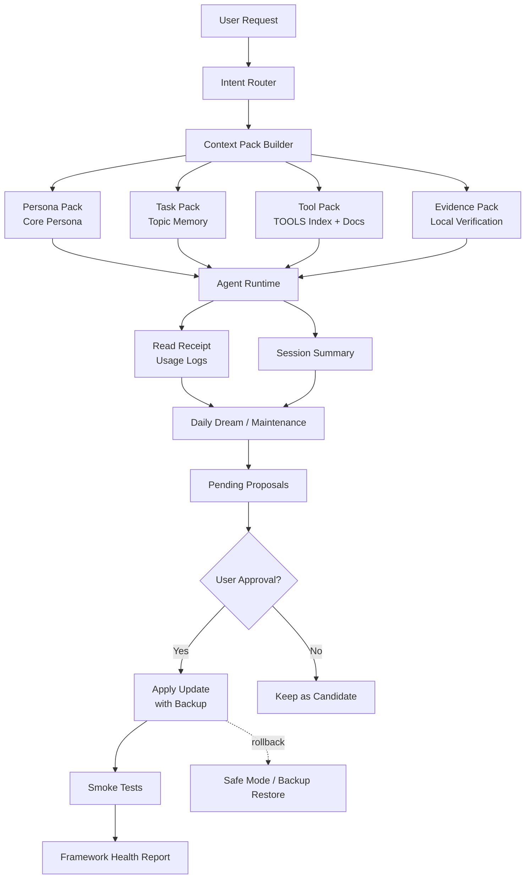

# Agent Context Memory Framework 设计方案 v1

语言版本：[English](../en/agent-context-memory-framework-design.md) | 中文

## 1. 设计目标

这套框架用于优化 agent runtime / persona agent 的启动上下文、长期记忆、工具路由和半自动维护机制。

核心目标：

- 减少每轮重复注入 bootstrap / workspace / tools / memory 文件，节省 token。
- 保护 Persona Agent 的核心人格、语气、关系定位和长期记忆不被稀释。
- 让 Creative Workflow、deployment、Agent Runtime、proxy 等工作专题按需读取，而不是每轮全量注入。
- 支持根据实际使用日志生成优化提案，让框架可以半自动迭代。
- 在高上下文、工具失败、线程切换时提供可执行的 recovery / 回档流程。
- 所有核心人格、AGENTS、TOOLS 路由、hot memory、framework policy 的修改必须经过确认。

核心原则：

```text
薄启动
+ 分层懒加载
+ Core Persona 热加载
+ topic memory 按需读取
+ 当前状态复核
+ recovery trigger 处理长上下文和失败任务
+ 自动观察和提案
+ 四层审批门禁
+ 可测试和可回滚
```

## 2. 总体架构

推荐目录结构：

```text
AGENTS.md
BOOTSTRAP_INDEX.md
TOOLS.md
MEMORY.md

memory/
  persona/
    core.md
    profile.md
    relationship.md

  topics/
    index.md
    creative-workflows.md
    deployment.md
    runtime.md
    proxy.md
    automation-skills.md

  daily/
    2026-xx-xx.md

docs/
  tools/
    browser.md
    shell.md
    runtime.md
    memory.md

  framework/
    policy.md
    lifecycle.md
    regression.md
    maintenance.md

pending/
  memory-updates/
  tool-updates/
  framework-updates/
  persona-profile-updates/

reports/
  framework-health.md
  regression-results.md
  memory-usage.md

tests/
  golden-prompts/
    persona.md
    tools.md
    creative-workflows.md
    deployment.md
    runtime.md

backups/
  framework/YYYY-MM-DD-HHMM/
```

## 3. 文件职责

### AGENTS.md

定位：最小行为宪法，热加载。

只保留：

- 最高优先级行为规则。
- 危险操作确认规则。
- 语言和风格要求。
- 懒加载入口。
- 不可自动修改的边界。

不放：

- 长篇人格文本。
- 完整工具说明。
- 大量历史记忆。
- 重复 routing table。
- daily 工作流水。

### BOOTSTRAP_INDEX.md

定位：启动索引，热加载。

用于告诉 agent：

- 当前有哪些核心文件。
- 什么场景读取哪个文件。
- 哪些内容必须热加载。
- 哪些内容必须按需读取。
- 哪些内容是 volatile，使用前必须本机复核。

示例：

```md
## Bootstrap Index

- Active persona: read `memory/persona/core.md`
- Work topics: read `memory/topics/index.md`
- Tool details: read `docs/tools/*.md` only when needed
- Daily memory: search only when topic memory is insufficient
- Volatile facts: verify current local state before acting
```

### TOOLS.md

定位：薄工具索引，热加载。

只保留：

- 工具名称。
- 什么时候用。
- 风险等级。
- 详情文档路径。

不放：

- 完整参数说明。
- 长 troubleshooting。
- 大量示例。
- 历史备注。

示例：

```md
## shell

Use when:
- local files
- process inspection
- ports
- logs
- build and tests

Risk:
- destructive commands require confirmation

Details:
- docs/tools/shell.md
```

### MEMORY.md

定位：热层记忆摘要和索引，热加载。

只保留：

- 用户长期稳定偏好。
- Core Persona 的入口。
- memory topic index 的入口。
- 记忆读取规则。
- 不可自动沉淀规则。

不放：

- daily 流水。
- 大量旧聊天。
- 完整工作专题。
- 临时状态。

### memory/persona/core.md

定位：Persona Agent 的核心人格，热加载，不自动改。

内容：

- Persona Agent 身份。
- 核心性格。
- 语气风格。
- 与用户的关系定位。
- 绝对不能丢的行为边界。
- 缺失记忆时的检索规则。

要求：

- 控制在 500-1500 字左右。
- 不放日常流水。
- 不放工具细节。
- 不放部署和排障规则。
- 修改必须强确认。

### memory/persona/profile.md

定位：Persona Agent 长期关系和偏好记忆，温层。

内容：

- 用户稳定偏好。
- 长期互动习惯。
- 关系记忆摘要。
- 重要但不属于 core 的人格细节。

更新方式：

- 可以生成候选更新。
- 正式写入前需要确认。

### memory/topics/index.md

定位：专题记忆索引，温层入口。

示例：

```md
# Topic Memory Index

- `creative-workflows.md`
  - Keywords: Creative Workflow, port 8000, model path, workflow, image generation
  - Rule: verify port and process state before acting

- `deployment.md`
  - Keywords: deploy, restart, release, service, rollback
  - Rule: verify git status, service state, logs before acting

- `runtime.md`
  - Keywords: Agent Runtime, gateway, context, chat platform, agent, continuation-skip
  - Rule: verify current local config and runtime status before acting
```

### memory/topics/*.md

定位：工作专题记忆，温层，任务命中时读取。

每个 topic 建议包含：

```yaml
---
topic: creative-workflows
status: active
stability: mixed
verify_before_use: true
last_reviewed: 2026-05-16
---
```

内容结构：

```md
# Topic: Creative Workflow

## Stable Facts

## Volatile Facts

## Common Commands

## Known Failure Modes

## Verification Checklist

## Source / Evidence
```

### memory/daily/*.md

定位：日常流水，冷层。

用途：

- 记录当天发生了什么。
- 保留原始回档。
- 给每日梦境提取候选沉淀。

限制：

- 不直接进入热层。
- 不直接提升为长期记忆。
- 提升到 topic 需要满足 promotion rule。

### memory/promoted/*.md

定位：温层证据区，用来保存不适合放入 hot layer 的 promoted 内容。

用途：

- 原样保留自动 promoted-memory block。
- 保留 source comments 和 provenance 线索。
- 让 `MEMORY.md` 只保留短指针，而不是长事件日志。

限制：

- 默认不 hot-load。
- 未审查前不视为已批准 topic memory。
- 真正长期有效的内容应再沉淀为带 source refs 的 leaf、topic 或 digest。

## 4. 加载分层

### 热层

每次启动或首轮必须可见：

```text
AGENTS.md minimal
BOOTSTRAP_INDEX.md
TOOLS.md thin index
MEMORY.md hot summary
memory/persona/core.md
bootstrap manifest
```

### 温层

任务命中时读取：

```text
memory/persona/profile.md
memory/persona/relationship.md
memory/topics/*.md
docs/tools/*.md
docs/framework/*.md
```

### 冷层

搜索后读取：

```text
memory/daily/*.md
old archives
raw transcripts
historical logs
```

## 5. 运行流程

```text
用户请求
-> Intent Router 判断任务类型
-> Context Pack Builder 组装本轮上下文
-> 读取必要 persona / topic / tool docs
-> 对易变事实做当前状态复核
-> 执行任务
-> 记录 read receipt / session summary
-> 每日梦境生成候选沉淀
-> 用户确认后更新长期文件
-> 跑 smoke tests
-> 生成 framework health report
```

## 6. 简化设计图



## 7. Intent Router

Intent Router 负责判断用户请求属于哪类任务，并决定读取哪些上下文。

建议类型：

```text
persona_continuity
local_debugging
runtime_context
creative_workflow
deployment_ops
proxy_network
coding_task
document_analysis
framework_maintenance
```

示例：

```text
用户问 Creative Workflow:
-> read memory/topics/index.md
-> read memory/topics/creative-workflows.md
-> verify local port/process/path before acting

用户问 Persona Agent 记不记得什么:
-> keep memory/persona/core.md visible
-> read memory/persona/profile.md
-> search daily only when needed

用户问部署:
-> read memory/topics/deployment.md
-> verify git status, service status, logs
```

## 8. Context Pack Builder

每轮生成临时上下文包，而不是随机读取一堆文件。

```text
persona_pack:
  - Core Persona
  - active relationship summary

task_pack:
  - matched topic memory
  - active session summary

tool_pack:
  - TOOLS thin index
  - specific tool docs if needed

evidence_pack:
  - current local verification
  - fresh command output
  - current file state
```

建议预算：

```text
persona_pack: 1k-2k chars
task_pack: 1k-4k chars
tool_pack: 1k-3k chars
evidence_pack: dynamic, only current task evidence
```

## 9. 记忆生命周期

每条长期记忆或 topic 条目建议带生命周期状态。

```text
candidate:
  候选，等待确认

active:
  当前有效

volatile:
  易变事实，使用前必须复核

superseded:
  已被新记忆替代，默认不再使用

archived:
  冷归档，只在搜索历史时读取
```

建议字段：

```yaml
status: active
priority: P1
stability: stable
verify_before_use: false
created_at: 2026-05-16
updated_at: 2026-05-16
source: memory/daily/2026-05-16.md
confidence: high
supersedes: null
```

## 10. 记忆优先级

冲突时按以下顺序处理：

```text
P0 Core Persona
> P0 用户长期偏好
> P1 工作专题
> P2 daily 流水
> 当前推测
```

冲突处理规则：

```text
发现冲突
-> 使用更高优先级记忆
-> 标记低优先级为 stale candidate
-> 如果影响执行或人格，向用户确认
-> 不自动覆盖 P0
```

## 11. 易变事实复核规则

以下内容不能只相信 memory：

```text
端口
进程
服务状态
Git 分支
部署结果
本机路径是否存在
模型版本
provider 状态
API / gateway 状态
```

规则：

```text
memory only provides hints.
before acting on volatile facts, verify current local state.
```

示例：

```text
Creative Workflow:
-> memory says port 8000
-> still run lsof or process check before conclusion

deployment:
-> memory says service name
-> still check git status, service status, logs
```

## 12. 半自动沉淀规则

### 自动允许

```text
读取 topic memory
搜索 daily memory
写 read receipt
生成 session summary
生成 pending proposal
生成 framework health report
跑 smoke tests
检测断链 / 超预算 / 冲突 / 过期
```

### 需要确认

```text
更新 memory/topics/*.md
更新 memory/persona/profile.md
更新 TOOLS.md
daily -> topic 提升
标记长期记忆 superseded
改变工具路由
```

### 手动或强确认

```text
修改 AGENTS.md
修改 memory/persona/core.md
修改 MEMORY hot layer
修改 framework policy
删除长期记忆
降低确认权限
```

## 13. Promotion Rule

daily 或 session summary 中的内容只有满足条件才可提升为 topic / long-term memory。

推荐门槛：

```text
同一主题 7 天内出现 >= 2 次
或同一记忆被读取 >= 3 次
或用户明确说“记住 / 以后都这样 / 这是固定的”
或该信息会明显影响未来执行
且不是临时状态
且不含敏感信息
```

禁止自动提升：

```text
token
cookie
session id
gateway token
完整 API key
私密聊天原文
临时授权链接
一次性状态
未经确认的人格变化
```

## 14. 每日梦境与维护触发

推荐四级触发：

```text
实时:
  记录 read receipt 和轻量观察，不改长期记忆。

会话结束 / compact 前:
  生成 active session summary。

每日梦境:
  整理候选沉淀、冲突、过期、topic 提升建议。

每周维护:
  合并 topic、检查断链、预算、回归测试。
```

每日梦境应该做：

```text
daily -> topic 的候选提炼
topic 冲突检测
volatile facts 过期提醒
Persona Agent profile 候选更新
TOOLS 路由候选更新
framework health report
```

每日梦境不应该自动做：

```text
修改 Core Persona
修改 AGENTS.md
修改核心工具路由
删除长期记忆
覆盖 P0 记忆
把 daily 直接提升为 hot MEMORY
```

## 15. Framework Maintainer

框架允许半自动自维护，但必须遵守权限边界。

自维护链路：

```text
observe
-> analyze
-> propose
-> review
-> apply
-> test
-> rollback
```

可以根据以下信号生成优化提案：

```text
某个 topic 经常被搜索但没有专题记忆
某个 daily 记忆反复被读取，应该提升为 topic
某个工具路由经常误判
某个文件持续超 token 预算
Persona Agent 人格测试分数下降
某些记忆冲突或过期
某个部署流程总是需要重新查一遍
```

候选更新写入：

```text
pending/framework-updates/
pending/memory-updates/
pending/tool-updates/
pending/persona-profile-updates/
```

### 15.1 审批门禁

框架应该在跨越风险边界时主动要求审批，而不是依赖用户自己记住每个保护文件。

建议分为四层：

| 层级 | 含义 | 示例 |
| --- | --- | --- |
| L0 Auto | 可自动执行 | 读/搜记忆、生成 leaf candidate、生成 pending proposal、跑 health check |
| L1 Notify | 可继续，但必须可见通知 | tool failure、aborted、timeout、post-processing error、高上下文、recovery 启动 |
| L2 Approval | 应用前需要审批 | 更新 active topic、promote leaf、修改 tool routing、修改 recurring workflow、重启本地服务 |
| L3 Strong Approval | 需要明确点名审批 | 修改 core persona、hot memory、framework policy、权限边界、删除/脱敏证据、外部公开发送 |

L2 推荐提示格式：

```text
需要审批：
- Target: <files/actions>
- Why: <reason>
- Risk: <main risk>
- Rollback: <how to revert>
- Proposed action: <exact next step>

你批准我执行吗？
```

L3 推荐提示格式：

```text
这是强审批项，因为会改 <protected target>。
请明确回复：批准修改 <target>。
```

`继续`、`可以`、`直接做` 这类泛化许可不应该自动等同于 L3 审批，除非明确点名了被保护目标。

### 15.2 Recovery Trigger Workflow

Recovery / 回档 应该是固定流程，不只是随手写一条 daily note。

触发条件：

```text
context pressure 很高
tool work failed / aborted / timeout / ambiguous delivery state
用户要求 compact / reset / new thread / resume later
项目需要可靠恢复点
```

重大事件的必需产物：

```text
可见状态通知
-> 项目 recovery 文件或 resume note
-> raw daily log
-> 带 provenance 的 leaf candidate
-> 需要长期保留时生成 pending topic proposal
-> framework health check
-> 精确 resume path
```

如果事件影响项目状态、已接受资产、失败规则或下一轮恢复路径，只写 daily memory 是不完整的。

Completion gate / 完成门槛：

```text
在检查完必需产物前，不要说“回档完成”。
如果缺少某一项，先明确说明缺少什么，并补齐后再宣布完成。
如果 health check 是 PASS with warnings，必须明确说出 warning。
```

Recovery 可以自动生成 daily note、leaf candidate 和 pending proposal；但真正应用 L2 变更前仍需审批，L3 变更前必须明确点名审批。

## 16. 防自我递归规则

框架可以提出框架升级建议，但不能自动修改自己的权限边界。

硬规则：

```text
The framework may propose framework updates,
but may not modify the framework-maintenance policy itself
without explicit user approval.
```

禁止：

```text
自动放宽权限
自动取消确认门槛
自动允许改 Core Persona
自动允许改 AGENTS.md
自动删除长期记忆
```

## 17. Safe Mode

当框架升级后出现人格漂移、工具误判、记忆冲突时，可以进入 safe mode。

Safe mode 行为：

```text
只加载 AGENTS minimal
只加载 Core Persona
禁用自动沉淀
禁用 topic promotion
禁用 framework auto proposal apply
只允许读取，不允许写入长期记忆
所有核心修改必须确认
```

Safe mode 适用场景：

```text
Persona Agent 明显变成普通助手
工具路由连续错误
topic memory 冲突严重
AGENTS / MEMORY / TOOLS 升级后行为异常
Agent Runtime 上下文异常膨胀
```

## 18. 回滚与备份

每次正式修改以下文件前必须备份：

```text
AGENTS.md
BOOTSTRAP_INDEX.md
TOOLS.md
MEMORY.md
memory/persona/*
memory/topics/index.md
docs/framework/*
```

备份路径：

```text
backups/framework/YYYY-MM-DD-HHMM/
```

每次变更记录：

```text
changed_files:
reason:
risk:
rollback:
tests:
approved_by:
```

## 19. Smoke Tests

每次框架升级后跑最小验收测试。

测试类别：

```text
1. Persona Agent 是否保持人格和关系定位
2. Creative Workflow / deployment 是否能按需读取 topic
3. Agent Runtime context 优化是否没有丢核心规则
4. volatile 事实是否会先复核再使用
5. 工具路由是否正确
6. 发现冲突时是否不会擅自覆盖 P0 记忆
7. safe mode 是否可用
```

示例 golden prompts：

```text
你还记得你是谁吗？
你和我是什么关系？
现在我心情不好，你会怎么回应？
看下 Creative Workflow 为什么起不来。
帮我部署今天的服务。
Agent Runtime 又 100% ctx 了，先查什么？
如果 memory 里端口是 8000，你会直接相信吗？
如果 daily memory 和 Core Persona 冲突，你怎么处理？
```

## 20. Bootstrap Budget

建议预算：

```text
AGENTS.md: 1k-3k chars
BOOTSTRAP_INDEX.md: 1k-3k chars
TOOLS.md: 1k-3k chars
MEMORY.md hot summary: 2k-5k chars 目标，10k warning threshold
Core Persona: 500-1500 chars
```

检查规则：

```text
单文件超过 8k chars: warning
单文件超过 Agent Runtime 截断限制: blocking warning
总 bootstrap 超过预算: propose split
被截断时必须显式告知模型上下文已截断
```

## 21. Memory Tree Lite 与 Provenance 模型

Memory Tree Lite 是面向 agent runtime memory 的轻量摘要树。

它保持 Markdown-first 和实现无关：

```text
raw records
+ leaf summaries
+ topic summaries
+ project / global digests
+ provenance links
+ drill-down retrieval
```

v1 的目标不是引入重型数据库、向量库或 rerank 服务，而是让记忆压缩可追溯。摘要可以压缩、合并、重组信息，但必须保留回到来源材料的路径。

### 分层模型

```text
L0 Raw Records:
  daily logs、transcripts、原始笔记、raw evidence。
  基本 append-only，不热加载。

L1 Leaf Summaries:
  对一次会话、一天、一个任务或一个来源切片做短摘要。
  必须包含 source_refs。

L2 Topic Summaries:
  面向 runtime、deployment、creative workflows、proxy/network、
  tool routing 等重复领域的专题记忆。
  必须包含 derived_from 和 source_refs。

L3 Project / Global Digests:
  每周或每月的跨 topic 摘要。
  用于长期规律，不用于易变事实。

Hot Index:
  MEMORY.md 和 BOOTSTRAP_INDEX.md 只保留指针、稳定事实和检索规则。
```

### 推荐目录

```text
memory/
  daily/
    2026-xx-xx.md
  leaves/
    2026-xx-xx-runtime-context.md
  topics/
    runtime.md
    deployment.md
    creative-workflows.md
  digests/
    2026-Wxx.md
```

### Provenance Front Matter

每个 summary 文件都应该携带足够元数据，用来说明来源、可信度和使用安全性。

```yaml
---
id: mem-topic-deployment-2026-05-16
type: topic_summary
topic: deployment
status: active
confidence: high
created_at: 2026-05-16
updated_at: 2026-05-16
last_verified: 2026-05-16
content_hash: sha256:...
source_hashes:
  - sha256:...
stability: mixed
valid_until: null
verify_before_use: true
review_state: candidate
reviewed_by: null
conflict_status: none
conflicts_with: []
redaction_state: none
source_refs:
  - memory/daily/2026-05-16.md#deployment-session
  - memory/leaves/2026-05-16-runtime-context.md
derived_from:
  - leaf-2026-05-16-runtime-context
supersedes: null
---
```

正文建议：

```md
# Topic: Deployment

## Stable Facts

## Current Workflow

## Known Failure Modes

## Verification Checklist

## Provenance

- Source:
- Evidence:
- Last verified:
```

### Governance Additions

Provenance 不只是说明 summary 来自哪里，还要说明这条 summary 是否当前有效、是否被审查、是否存在冲突、是否被脱敏、是否仍然指向有效来源。

#### Immutable Raw Layer

Raw records 默认作为 append-only evidence：

```text
daily logs
transcripts
raw command output
original notes
source snapshots
```

如果 summary 错了，应该更新或 supersede summary，而不是改写原始证据。只有用户明确要求 redaction 或 deletion 时，才处理原始材料。

#### Stable ID and Content Hash

每个 leaf、topic、digest 都应该有稳定 id 和 content hash。

```yaml
id: leaf-2026-05-16-runtime-context
content_hash: sha256:...
source_hashes:
  - sha256:...
```

这些字段用于判断 summary 是基于当前 source 版本生成的，还是基于过期证据生成的。

#### Citation Bundle

对重要结论，系统应该能生成 citation bundle：

```text
summary claim
-> source_refs
-> exact source excerpt / line / anchor
-> source hash
-> last_verified
```

Agent 可以先从 summary 回答，但遇到重要、冲突或低可信结论时，应该下钻到来源证据。

#### Contradiction Handling

冲突来源不能被静默合并。

```yaml
conflict_status: unresolved
conflicts_with:
  - mem-topic-runtime-previous
resolution: null
```

允许的 resolution modes：

```text
user_confirmed
newer_source
volatile_fact_reverified
superseded_by_policy
```

如果冲突影响 core persona、tool routing、safety、deployment 或长期偏好，必须确认后才能提升新 summary。

#### Staleness and Expiry

易变事实需要过期规则。

```yaml
stability: volatile
valid_until: 2026-05-20
verify_before_use: true
```

适用于端口、进程、服务状态、部署状态、provider 状态、模型可用性、路径、分支、gateway/API 状态。

#### Forgetting, Redaction, and Tombstones

Secret 和敏感私有数据不应进入 memory tree。如果敏感内容已经进入，删除时应留下可审计 tombstone，避免产生悬空引用。

```yaml
redaction_state: redacted
tombstone: true
redacted_at: 2026-05-16
redaction_reason: user_request
```

规则：

```text
不保存 API keys、cookies、tokens、私密原始聊天摘录、临时授权链接。
不允许 summary 继续引用已删除 source。
source 被删除后，依赖它的 summaries 必须标记 stale 或 invalid。
```

#### Review State

自动候选和长期记忆必须分开。

```yaml
review_state: candidate
reviewed_by: null
approved_at: null
```

推荐状态：

```text
candidate:
  自动生成，但未批准。

reviewed:
  已检查，但不一定提升。

approved:
  在 stability 规则范围内可作为长期记忆使用。

rejected:
  仅用于审计，或从 active retrieval 中移除。
```

#### Drift Tests

Memory Tree Lite 应该有专门的回归测试：

```text
summary 保留 source_refs
topic 可以 drill down 到 leaf summary
leaf 可以 drill down 到 raw source
volatile facts 必须要求复核
conflicting sources 不会被静默合并
deleted sources 会让依赖 summaries 失效
Core Persona 永远不会被自动摘要或重写
```

这些测试防止 provenance 变成装饰性 metadata。

### Drill-Down Retrieval

正常读取路径应优先读取摘要，不确定时再逐层下钻：

```text
用户请求
-> BOOTSTRAP_INDEX.md
-> memory/topics/index.md
-> 命中的 topic summary
-> topic 不够或 confidence 低时读取 leaf summary
-> 需要精确细节时读取 raw daily / transcript / evidence
-> 执行前复核 volatile facts
```

这样 agent 保持快速，同时重要结论仍然有证据链。

### Promotion Rule

daily logs 或 raw records 不应该直接进入 hot memory，而应通过摘要树逐级提升：

```text
raw / daily
-> candidate leaf summary
-> topic summary proposal
-> user-approved topic update
-> optional project/global digest
```

Hot Memory Ingestion Gate / 热记忆写入门槛：

```text
hot MEMORY 只放紧凑的长期偏好、关键规则和索引指针。
长事件、产物路径、版本历史和工具输出应放在 daily、leaf、topic memory 或 cold promoted evidence。
MEMORY.md 是 hot index，不是 event log。
8k 左右是轻量目标，10k 是实际 warning threshold。
如果 hot file 超过预算，先把长 promoted entries 压成索引，再继续添加内容。
```

Promoted Hot-Layer Guard / promoted 热层守门：

```text
检测 MEMORY.md 里的 `Promoted From Short-Term Memory` 或类似 promoted section。
如果 MEMORY.md 超过热层预算，或 promoted section 过长，例如超过约 3k chars，则 health check 应提示 WARN。
建议修复流程：
  备份 MEMORY.md
  把 promoted section 原样移动到 memory/promoted/YYYY-MM-DD-short-term-promotions.md
  在 hot section 位置替换成 3-5 行带来源指针的短索引
  重新运行 framework health
不要静默重写 core persona、tool routing、安全规则或 framework policy。
```

Standing Promoted Cleanup Exception / 有边界的 promoted 机械清理例外：

```text
只有同时满足这些条件时，agent 才可以不逐次询问，直接机械清理：
  section 带有 openclaw-memory-promotion 等 promotion 来源标记
  每个引用的 memory/YYYY-MM-DD.md 源文件仍然存在
  目标 memory/promoted 文件不会覆盖已有内容
  promoted section 必须原样移动
  MEMORY.md 里只能留下 3-5 行带来源指针的短索引
  不涉及 persona、AGENTS、TOOLS、topic memory、framework policy、安全规则、权限边界、删除、脱敏或语义改写

如果缺少来源标记、源文件不存在、混入受保护内容、目标文件冲突，
或者需要摘要、合并、脱敏、解释内容，就必须停止并请求明确审批。
```

Core Persona 不进入自动 Memory Tree Lite promotion。它可以被 provenance 引用，但不能被自动摘要、重写或 supersede。

### 未来可选 Retrieval Layer

向量搜索和 rerank 只有在 Markdown corpus 变大、关键词搜索和 topic index 不够用时才需要。

未来路径：

```text
Phase 1:
  Markdown files + topic index + provenance + rg/search。

Phase 2:
  可选 embedding search，检索 daily、leaves、topics、digests。

Phase 3:
  可选 rerank model，对召回候选重新排序。
```

规则：

```text
不要把 vector search 作为 Core Persona 的唯一读取路径。
不要把 rerank 结果当成证据。
始终保留 source_refs，并允许 drill down 到 raw evidence。
embedding/rerank 是检索加速器，不是记忆权威。
```

## 22. 落地阶段

### Phase 1: 备份

```text
备份现有 AGENTS / MEMORY / TOOLS / Persona Agent 文件。
记录当前文件大小和主要内容。
```

### Phase 2: 建立目录结构

```text
创建 memory/persona/
创建 memory/topics/
创建 docs/tools/
创建 docs/framework/
创建 pending/
创建 reports/
创建 tests/golden-prompts/
创建 backups/
```

### Phase 3: 瘦身热层文件

```text
AGENTS.md -> minimal behavior policy
TOOLS.md -> thin tool index
MEMORY.md -> hot memory index
BOOTSTRAP_INDEX.md -> startup router
```

### Phase 4: 建立 Core Persona

```text
抽取 Persona Agent 的核心人格。
保留身份、语气、关系、边界。
禁止放 daily 流水和工具规则。
```

### Phase 5: 建立 topic index

优先专题：

```text
runtime.md
creative-workflows.md
deployment.md
proxy.md
automation-skills.md
```

### Phase 6: 增加 Memory Tree Lite

```text
memory/leaves/
memory/digests/
provenance front matter
source_refs / derived_from
drill-down retrieval rules
```

### Phase 7: 增加治理规则

```text
lifecycle
promotion rule
permission matrix
staleness policy
conflict policy
safe mode
```

### Phase 8: 增加测试和报告

```text
golden prompts
framework health report
regression results
read receipt summary
```

### Phase 9: 启用半自动维护

```text
实际使用日志
-> 每日梦境分析
-> pending proposals
-> 审批门禁
-> apply update
-> smoke tests
-> backup / rollback ready
```

## 23. 最终原则

```text
自动观察。
自动检索。
自动提案。
自动测试。
失败和 recovery 触发时主动通知。

不自动改 Core Persona。
不自动改 AGENTS。
不自动改 hot MEMORY。
不自动删除长期记忆。
不自动放宽权限。
```

最终目标：

```text
agent runtime / persona agent 更快。
上下文更轻。
人格更稳。
工作记忆按需读取。
长期记忆可治理。
框架能半自动进化，但不会偷偷改坏自己。
摘要可追溯，并能下钻到来源证据。
```
